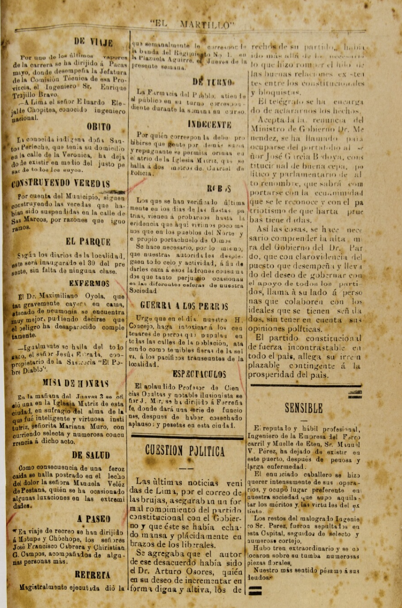

# 📰 El Martillo OCR Analysis

<p align="center">
  
</p>

<p align="center">
  <strong>AI-Powered OCR Digitization of a Historical Peruvian Newspaper</strong>
</p>

<p align="center">
  <a href="https://www.python.org/"></a>
  <a href="https://www.anthropic.com/"></a>
  <a href="https://pandas.pydata.org/"></a>
  <a href="https://jupyter.org/"></a>
</p>

---

## 🎯 Overview

This project uses **Claude API's vision capabilities** to extract and analyze text from a scanned page of **El Martillo**, a historical Peruvian newspaper published in Chiclayo between 1903-1919.

### What is El Martillo?

**El Martillo** ("The Hammer") was a regional newspaper that served the Lambayeque region of northern Peru. It documented local news, social events, municipal developments, and national politics during a transformative era in Peruvian history.

---

## 📂 Repository Structure

```
el-martillo-ocr-gabriel/
├── 📓 el_martillo_ocr.ipynb          # Main analysis notebook
├── 📊 REPORT.md                       # Detailed analysis report
├── 📖 README.md                       # This file
├── 🔒 .env                            # API key (git-ignored)
├── 🚫 .gitignore                      # Git ignore rules
│
└── 📁 data/
    └── 📁 el_martillo/
        ├── 🖼️  page_01.png             # Scanned newspaper page
        ├── 📄 extracted_content.csv    # Structured dataset
        └── 📈 content_analysis.png     # Generated visualization
```

---

## ✨ Features

| Feature | Description |
|---------|-------------|
| 🤖 **AI-Powered OCR** | Uses Claude API vision for accurate historical text extraction |
| 💾 **Smart Caching** | Skips API calls if data already extracted (saves tokens!) |
| 🔐 **Secure Config** | API keys stored in `.env` file (git-ignored) |
| 📊 **Auto Visualization** | Generates charts for content analysis |
| 🧹 **Data Cleaning** | Normalizes and structures extracted text |

---

## 🚀 Quick Start

### Prerequisites

- Python 3.9+
- Conda (recommended) or pip
- Anthropic API key

### Installation

1. **Clone the repository:**
   ```bash
   git clone https://github.com/gsaco/el-martillo-ocr-gabriel.git
   cd el-martillo-ocr-gabriel
   ```

2. **Create conda environment:**
   ```bash
   conda create -n ocr python=3.11 -y
   conda activate ocr
   ```

3. **Install dependencies:**
   ```bash
   pip install anthropic pandas matplotlib pillow python-dotenv ipykernel
   ```

4. **Configure API key:**
   ```bash
   # Create .env file
   echo "ANTHROPIC_API_KEY=your-api-key-here" > .env
   ```

5. **Run the notebook:**
   ```bash
   jupyter notebook el_martillo_ocr.ipynb
   ```

---

## � Results

### Extracted Data Summary

| Metric | Value |
|--------|-------|
| **Total Items** | 16 |
| **Articles** | 12 (75%) |
| **Announcements** | 3 (18.75%) |
| **Editorial** | 1 (6.25%) |

### Sample Headlines Extracted

| Headline | Type | Description |
|----------|------|-------------|
| 📰 *DE VIAJE* | Article | Travel notices of local figures |
| ⚒️ *CONSTRUYENDO VEREDAS* | Article | Municipal sidewalk construction |
| 🎭 *ESPECTÁCULOS* | Article | Entertainment news |
| 🏛️ *CUESTIÓN POLÍTICA* | Editorial | National political commentary |
| ⚰️ *ÓBITO* | Announcement | Obituary notice |

### Dataset Columns

| Column | Description | Example |
|--------|-------------|---------|
| `date` | Publication date | `unknown` |
| `issue_number` | Issue identifier | `unknown` |
| `headline` | Article title | `DE VIAJE` |
| `section` | Content section | `news` |
| `type` | Content type | `article` |
| `text_excerpt` | First 200-300 chars | `Por uno de los últimos vapores...` |

---

## 💡 Key Insights

### 1. 📍 Provincial Life as Community Bulletin
The newspaper served as a **community bulletin**, documenting:
- Travels of local figures to nearby towns
- Health updates of community members
- Deaths and memorial services

### 2. 🏗️ Urban Development in Progress
Evidence of active **municipal improvements**:
- *"CONSTRUYENDO VEREDAS"* - Sidewalk construction on San Marcos street
- *"EL PARQUE"* - Ongoing beautification of the city park

### 3. 🌐 Connection to National Affairs
Despite being provincial, the newspaper covered:
- National politics (*"Cuestión Política"*)
- International entertainment (traveling illusionist to Barcelona)
- Regional commerce (Eten Railroad references)

---

## 📖 Documentation

| Document | Description |
|----------|-------------|
| 📊 [`REPORT.md`](REPORT.md) | **Full analysis report** with OCR challenges, methodology, and detailed insights |
| 📓 [`el_martillo_ocr.ipynb`](el_martillo_ocr.ipynb) | Jupyter notebook with complete code |
| 📄 [`extracted_content.csv`](data/el_martillo/extracted_content.csv) | Structured dataset |

---

## 📜 Data Source

**El Martillo** (Chiclayo, Peru, 1903-1919)

🔗 **Archive:** [Fuentes Históricas del Perú - El Martillo](https://fuenteshistoricasdelperu.com/2020/12/06/el-martillo-chiclayo-1903-1919/)

---

## ✅ Deliverables Checklist

- [x] Python Notebook (`.ipynb`)
- [x] Structured Dataset (`.csv`)
- [x] Short Report (`.md`) with chart and insights
- [x] Raw newspaper image (`.png`)
- [x] README documentation
- [x] Secure API key management (`.env` + `.gitignore`)

---

## 👤 Author

**Gabriel Saco**

*Digital Humanities OCR Assignment — November 2025*

---

## 📄 License

This project is for educational purposes. Historical newspaper images are sourced from public digital archives.
