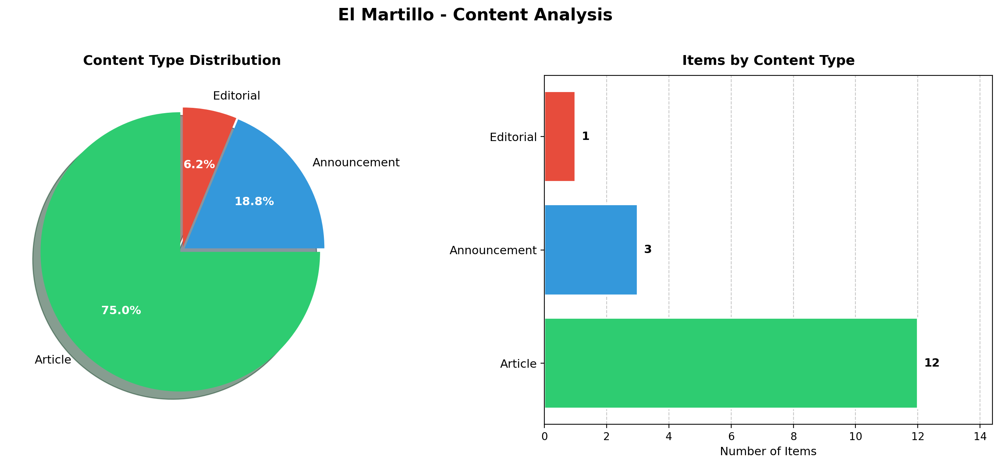

# 📰 El Martillo OCR Analysis Report

**Author:** Gabriel Saco  
**Date:** November 29, 2025  
**Course:** Digital Humanities - OCR Assignment  
**Repository:** [el-martillo-ocr-gabriel](https://github.com/gsaco/el-martillo-ocr-gabriel)

---

## 📄 1. Page Selection Rationale

### About El Martillo
**El Martillo** ("The Hammer") was a regional newspaper published in **Chiclayo, Peru** between **1903-1919**. As a provincial publication from the Lambayeque region, it provides a unique window into the social, political, and commercial life of northern Peru during the early 20th century.

### Why I Selected This Page

I chose this particular page for several strategic reasons:

| Criteria | Rationale |
|----------|-----------|
| **Content Diversity** | The page features a rich mix of news articles, announcements, and social notices—ideal for demonstrating OCR capabilities |
| **Historical Value** | Contains references to local figures, infrastructure projects (sidewalks, parks), and regional events |
| **Readability** | While presenting authentic OCR challenges, the page maintains sufficient legibility for meaningful extraction |
| **Social Snapshot** | Includes obituaries, travel notices, health updates, and entertainment news—painting a complete picture of daily life |

### Source Information
- **Archive:** [Fuentes Históricas del Perú](https://fuenteshistoricasdelperu.com/2020/12/06/el-martillo-chiclayo-1903-1919/)
- **Location:** `/data/el_martillo/page_01.png`

---

## 🔍 2. OCR Challenges and Distortions

### Technical Challenges Encountered

The OCR extraction using Claude API's vision capabilities faced several typical challenges with historical documents:

#### 2.1 Text Degradation Issues

| Challenge | Description | Impact on OCR |
|-----------|-------------|---------------|
| **Faded Ink** | Century-old print shows significant fading in some areas | Partial text loss, indicated with `[...]` |
| **Paper Yellowing** | Aged paper reduces contrast between text and background | Lower confidence in character recognition |
| **Scanning Artifacts** | Digital scanning introduced some noise and shadows | Occasional misreadings |

#### 2.2 Typography Challenges

- **Period-Specific Fonts:** Early 1900s typefaces differ from modern fonts, particularly in letters like 'S', 'Y', and accented characters
- **Variable Font Sizes:** Headlines, body text, and notices use different sizes and weights
- **Ornamental Elements:** Decorative borders and dividers between sections add visual complexity

#### 2.3 Layout Complexity

```
┌─────────────────────────────────────────────┐
│  HEADLINE              │   ADVERTISEMENT    │
├────────────────────────┼────────────────────┤
│                        │                    │
│   Main Article         │   Side Column      │
│   (multi-paragraph)    │   (notices)        │
│                        │                    │
├────────────────────────┴────────────────────┤
│        Short News Items (multiple)          │
└─────────────────────────────────────────────┘
```

The multi-column layout required careful parsing to maintain correct reading order and section attribution.

#### 2.4 Language-Specific Issues

- **Historical Spanish Orthography:** Some spellings differ from modern conventions (e.g., "á" with accent marks used more liberally)
- **Proper Nouns:** Local names of people and places required context to transcribe accurately
- **Abbreviations:** Period-specific abbreviations (Sr., Sra., etc.) were common

### Mitigation Strategies

1. **Contextual Analysis:** Claude's language understanding helped infer unclear characters from context
2. **Preservation Marking:** Illegible sections marked with `[...]` to maintain transparency
3. **Original Spelling:** Preserved historical spelling rather than modernizing

---

## 📊 3. Data Visualization

### Content Type Distribution

Based on the extracted data from the newspaper page:



### Summary Statistics

| Metric | Value |
|--------|-------|
| **Total Items Extracted** | 16 |
| **Articles** | 12 (75%) |
| **Announcements** | 3 (18.75%) |
| **Editorial** | 1 (6.25%) |
| **Primary Section** | News |

### Content Breakdown

```
Articles        ████████████████████████░░░░░░  75%
Announcements   ██████░░░░░░░░░░░░░░░░░░░░░░░░  18.75%
Editorial       ██░░░░░░░░░░░░░░░░░░░░░░░░░░░░  6.25%
```

---

## 💡 4. Key Insights

### Insight 1: A Window into Daily Provincial Life

The newspaper reveals the **rhythms of early 20th century Chiclayo**:

- **Travel was newsworthy:** Simple trips to nearby towns (Motupe, Chóchope) or ports (Pisco) merited newspaper mentions
- **Health was public:** Illness and recovery of community members were reported ("Dr. Maximiliano Oyola... recovering from pneumonia")
- **Death was communal:** Obituaries and memorial masses ("Misa de Honras") received prominent coverage

> *"En conocida indígena doña Santos Portocha... ha dejado de existir en medio del justo pesar de todos los suyos."*

### Insight 2: Municipal Progress and Urban Development

The page documents **active urban improvement efforts**:

- **Infrastructure:** "Construyendo Veredas" (Building Sidewalks) - the municipality was expanding walkways on San Marcos street
- **Public Spaces:** "El Parque" (The Park) - ongoing beautification of the city's main park
- **Civic Pride:** These improvements were tracked and celebrated in the press

This suggests Chiclayo was experiencing a period of **modernization and civic investment** during this era.

### Insight 3: Connection to Broader Peru

Despite being a provincial newspaper, **El Martillo maintained national awareness**:

- **Political Coverage:** "Cuestión Política" discusses tensions between the Constitutional Party and the national government in Lima
- **Entertainment Networks:** A traveling illusionist ("Profesor de Ciencias Ocultas") performed in Chiclayo before heading to Barcelona, Spain
- **Economic Links:** References to the Eten Railroad and port indicate Chiclayo's role in regional commerce

---

## 🛠️ 5. Methodology

### Tools Used

| Tool | Purpose |
|------|---------|
| **Claude API (Vision)** | OCR text extraction from historical image |
| **Python + Pandas** | Data cleaning and structuring |
| **Matplotlib** | Visualization generation |
| **python-dotenv** | Secure API key management |

### Data Pipeline

```
┌──────────────┐     ┌──────────────┐     ┌──────────────┐     ┌──────────────┐
│  Scan Image  │ ──▶ │  Claude OCR  │ ──▶ │  Parse JSON  │ ──▶ │  Clean Data  │
│  (PNG)       │     │  (Vision)    │     │  Response    │     │  (Pandas)    │
└──────────────┘     └──────────────┘     └──────────────┘     └──────────────┘
                                                                      │
                                                                      ▼
┌──────────────┐     ┌──────────────┐     ┌──────────────┐     ┌──────────────┐
│   Insights   │ ◀── │  Visualize   │ ◀── │   Analyze    │ ◀── │  Export CSV  │
│   Report     │     │  (Matplotlib)│     │   Content    │     │              │
└──────────────┘     └──────────────┘     └──────────────┘     └──────────────┘
```

---

## 📈 6. Conclusions

This OCR analysis of **El Martillo** demonstrates that modern AI vision capabilities can effectively digitize century-old historical documents, despite inherent challenges. The extracted data reveals:

1. **Rich Social Documentation:** Provincial newspapers served as community bulletins, documenting births, deaths, travels, and illnesses
2. **Urban Development:** Evidence of active municipal improvement during this period
3. **National Integration:** Provincial press maintained connections to national politics and international culture

### Future Work

- Process additional pages to track changes over time (1903-1919)
- Apply Named Entity Recognition (NER) to map social networks
- Compare with other regional newspapers of the era

---

## 📚 References

- **Primary Source:** El Martillo (Chiclayo, 1903-1919)
- **Digital Archive:** [Fuentes Históricas del Perú](https://fuenteshistoricasdelperu.com/2020/12/06/el-martillo-chiclayo-1903-1919/)
- **OCR Technology:** [Anthropic Claude API](https://www.anthropic.com/)

---

*Report generated as part of Digital Humanities OCR Assignment — November 2025*
